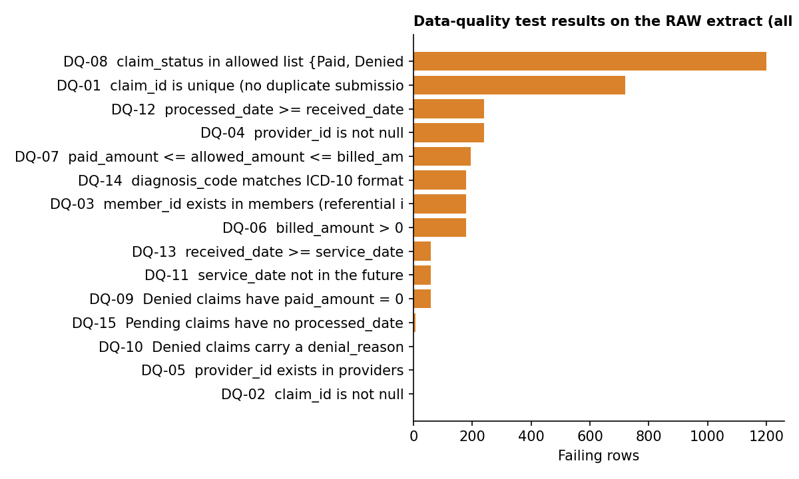
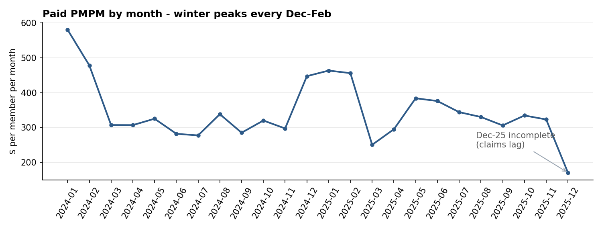
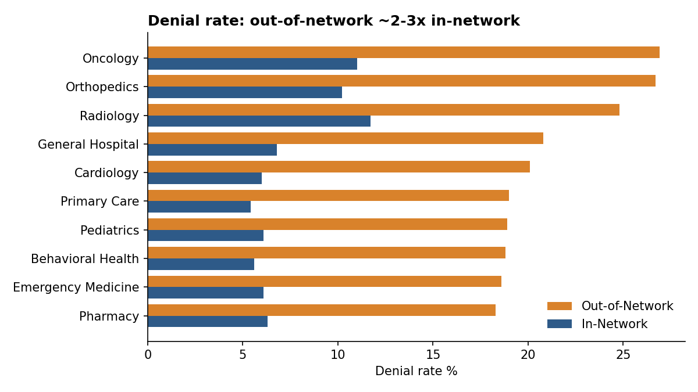
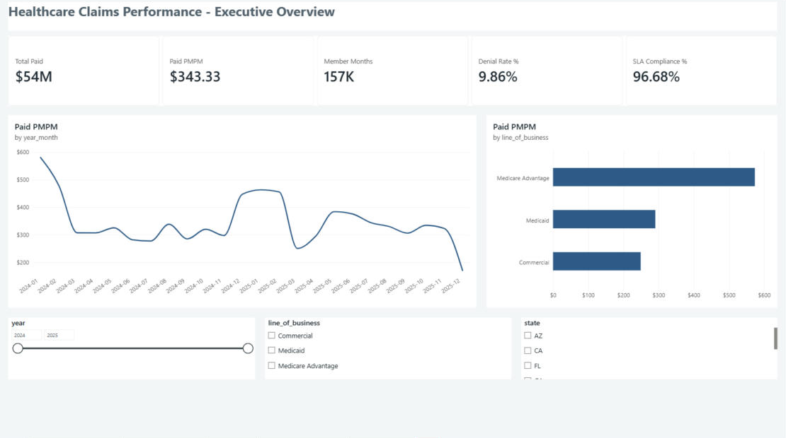
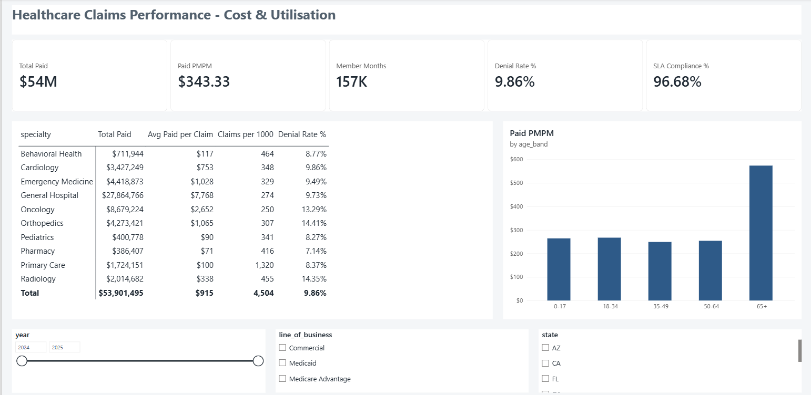
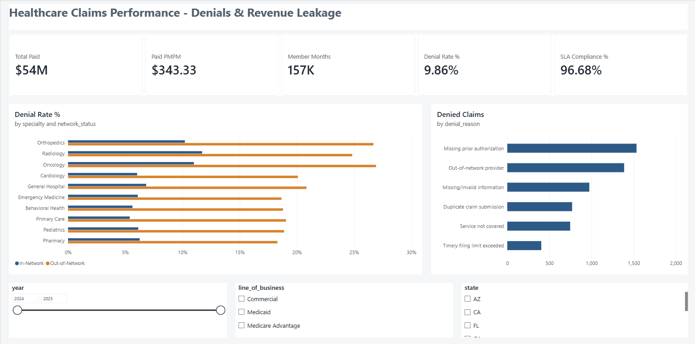
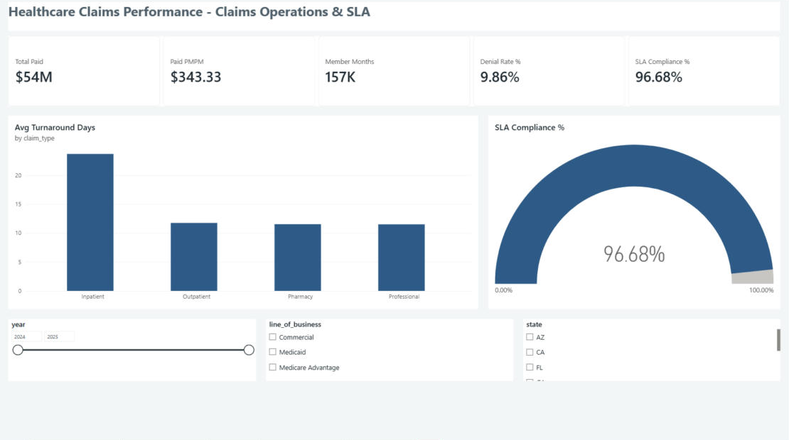
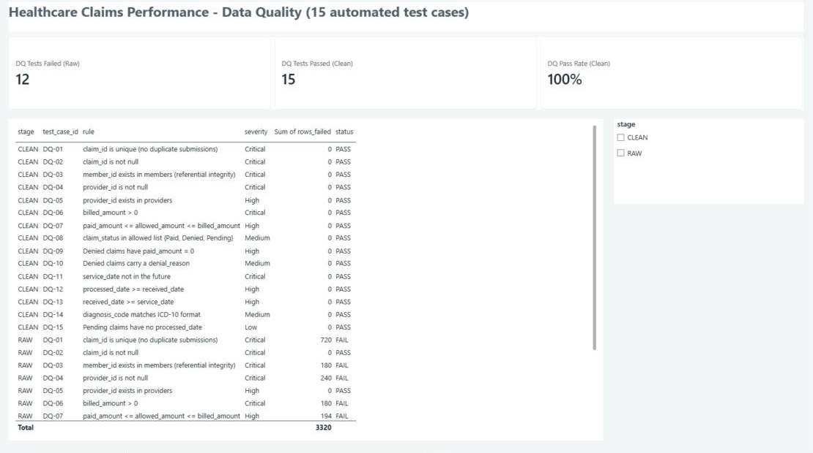

# Healthcare Claims Analytics & Data Quality BI Solution

**End-to-end BI project:** raw payer claims extract → automated data-quality testing → SQL star schema → KPI analysis → Power BI dashboard + Excel reporting pack.

`Python (pandas)` · `SQL (CTEs, window functions)` · `Power BI (DAX, star schema, RLS)` · `Excel` · `Data validation` · `ETL`

> **Data note:** all data is **synthetic**, generated by `src/01_generate_data.py` (seeded, so it's reproducible). There is no real patient information. It models a US health plan: 8,000 members, 400 providers, 5 plans across Commercial / Medicare Advantage / Medicaid, and about 60K claims from Jan 2024 to Dec 2025.

---

## Business problem
A health plan's operations and finance leaders need one trusted view of **cost (PMPM), claim denials, and processing SLAs**. The raw claims extract they receive has duplicates, broken keys, impossible dates and invalid amounts, so the numbers on existing reports don't agree. The project has two goals:
1. **Make the data trustworthy.** Build a repeatable validation layer that catches defects before they reach a report.
2. **Make it decision-ready.** Model it as a star schema and deliver standardised KPIs in Power BI and Excel.

## Architecture
```
 raw CSV extract ──► 15 automated DQ test cases ──► cleanse / quarantine ──► re-test (regression)
  (60,720 rows)       (PASS/FAIL, severity)          (business rules BR-01..07)     (0 failures)
                                                            │
                                                            ▼
                         SQLite star schema (PK/FK/CHECK constraints)
        fact_claims · fact_member_months · dim_member · dim_provider · dim_plan · dim_date
                                                            │
                     ┌──────────────────────────────────────┼──────────────────────────┐
                     ▼                                      ▼                          ▼
          10 SQL analyses (CTEs, LAG,           Power BI: 5-page dashboard,     Excel reporting pack
          RANK, NTILE, window SUM)              20+ DAX measures, RLS           (formula-driven, charts)
```

## Step 1: Data-quality testing (the QA mindset applied to data)
Each rule is written like a test case: an ID, a severity, an expected result and an actual result, ending in PASS or FAIL. The suite runs on the raw extract, then again on the cleansed output as a regression check.



| Result | Value |
|---|---|
| Test cases | 15 (5 Critical, 6 High, 3 Medium, 1 Low) |
| Failing on RAW extract | **12 of 15** |
| Failing after cleansing | **0 of 15** |
| Exact duplicates removed | 685 |
| Rows quarantined (returned to source with a reason) | 1,113 |
| Rows corrected by business rule | 1,392 (status casing, denied-but-paid, invalid ICD-10) |
| Reconciliation `raw = dupes + quarantined + loaded` | 60,720 = 685 + 1,113 + 58,922 ✅ |

Outputs: `outputs/dq_test_results.csv`, `dq_cleansing_log.csv`, `dq_reconciliation.csv`, `quarantined_claims.csv`

## Step 2: Star schema
See `sql/00_schema.sql`. `fact_member_months` exists because **PMPM has to be divided by member months, not by members**. A common mistake is dividing by distinct members, which inflates cost for plans where members churn.

## Step 3: Key findings (from `sql/01_kpi_analysis.sql`)

| # | Finding | So what? |
|---|---|---|
| 1 | Overall **paid PMPM is $343** on $53.9M paid across 156,995 member months | Baseline for budget tracking |
| 2 | **Out-of-network denial rate is 20.7% vs 7.0% in-network** (about 3x). It peaks at 26.9% for out-of-network Oncology and 26.7% for Orthopedics | Network-steering and provider-education opportunity |
| 3 | **"Missing prior authorization" is the #1 denial reason (26.4% of denials, $2.05M allowed value)** | An avoidable, process-driven denial. Target it with prior-auth reminders |
| 4 | **Medicare Advantage PMPM ($574) is 2.3x Commercial ($249)**, with about 2.3x the utilisation (7,640 vs 3,341 claims per 1,000/yr) | Explains the cost mix. Premiums and care management should reflect it |
| 5 | **Members with a chronic condition cost $700 PMPM vs $235** (3.0x) | A clear care-management target population |
| 6 | **The top 5% of members drive 25.7% of paid**, and the top 20% drive 61.1% | High-cost-claimant monitoring |
| 7 | **Inpatient claims meet the 30-day SLA only 83.2% of the time** (avg 23.7 days) vs 97%+ for other types. That's 578 breaches | Operations focus area |
| 8 | Claim volume in **Dec–Feb runs about 50% above** other months (flu season) | Staffing and capacity planning |




> **Caveat I flag on the report:** Dec 2025 looks like a sharp drop, but that month is incomplete (2,067 claims still pending, plus claims not yet received). Reporting it as a real cost decrease would be wrong.

## Step 4: Power BI dashboard
File: [`powerbi/Claims_BI_Dashboard.pbix`](powerbi/Claims_BI_Dashboard.pbix)

5 report pages plus a drill-through page: **Executive Overview · Cost & Utilisation · Denials · Claims Operations (SLA) · Data Quality · Specialty Detail**
- **Semantic model:** a star schema with 7 relationships (1-to-many, single direction), a marked date table, and 26 DAX measures in a dedicated `_Measures` table. The measures cover PMPM, claims per 1,000, denial rate, SLA %, and MoM / YoY / YTD time intelligence.
- **Built as code:** the whole model (Power Query sources, column types, relationships and measures) is defined in [`powerbi/model.tmdl`](powerbi/model.tmdl) and applied through Power BI's TMDL view. It's generated by [`powerbi/gen_tmdl.py`](powerbi/gen_tmdl.py).
- **Row-level security:** a `State_TX` role filters `dim_member[state] = "TX"`, so a regional manager sees only their own members.
- **Drill-through:** right-click any specialty (for example on the Denials page) and choose **Drill through → Specialty Detail** to see claim-level rows.
- **Reconciled:** the card totals match `outputs/sql_results/q01_executive_kpis.csv` exactly (58,922 claims · $53.9M paid · $343.33 PMPM · 9.86% denial rate · 96.68% SLA).

> The data source paths in the .pbix point to the author's local folder. To refresh it on your machine, go to **Transform data → Data source settings → Change source** and point each file to `powerbi/data/`.

**Executive Overview**


**Cost & Utilisation**


**Denials & Revenue Leakage**


**Claims Operations & SLA**


**Data Quality (15 automated test cases)**


→ Manual build steps: [`powerbi/BUILD_GUIDE.md`](powerbi/BUILD_GUIDE.md) · Measures: [`powerbi/DAX_measures.md`](powerbi/DAX_measures.md)

## Step 5: Recurring Excel report
`reports/Monthly_Claims_Report.xlsx` is a formula-driven pack (Summary KPIs, Monthly Trend with PMPM and MoM formulas, LOB, Denials, SLA, Data Quality) with native Excel charts. Blue cells are source data and black cells are formulas.

## Documentation
[`docs/metric_definitions.md`](docs/metric_definitions.md) has metric definitions, business rules BR-01 to BR-07, and known limitations.

## Run it
```bash
pip install -r requirements.txt
python run_all.py        # about 20 seconds: generates data, runs the DQ suite, builds the warehouse, SQL, and reports
```

## Repo structure
```
src/        01_generate_data · 02_data_quality · 03_build_warehouse · 04_run_sql · 05_build_reports
sql/        00_schema.sql · 01_kpi_analysis.sql
powerbi/    Claims_BI_Dashboard.pbix · model.tmdl · gen_tmdl.py · data/ (star-schema CSVs) · DAX_measures.md · BUILD_GUIDE.md · claims_theme.json
outputs/    DQ results, reconciliation, quarantine, sql_results/
reports/    Monthly_Claims_Report.xlsx
docs/       metric_definitions.md
images/     charts
```
